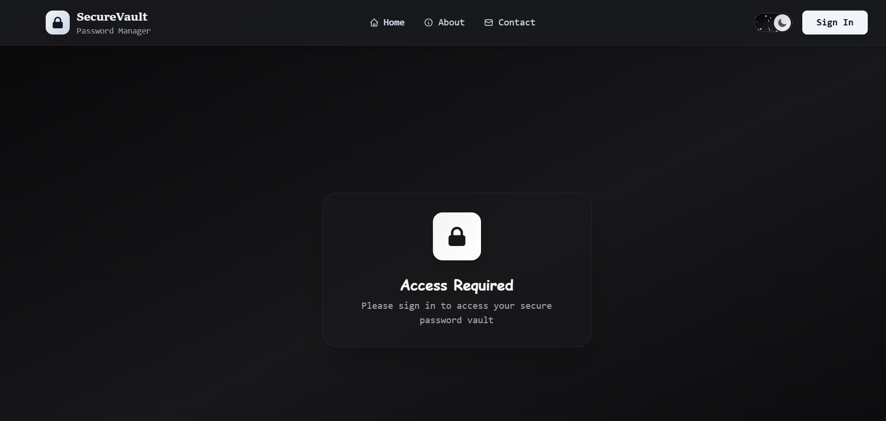
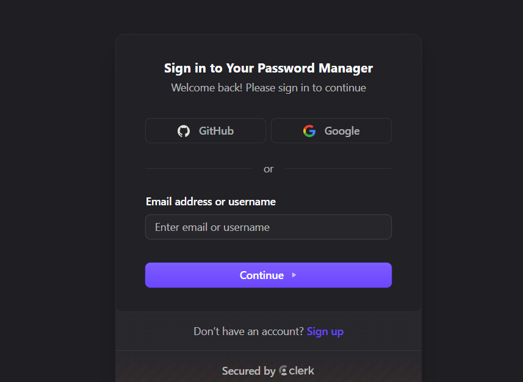
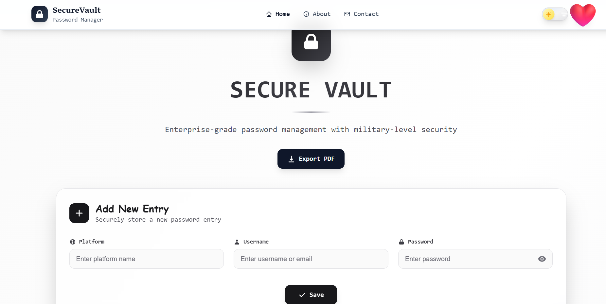

# SecureVault Password Manager

A comprehensive password management solution built with enterprise-grade security and modern web technologies. SecureVault provides users with a secure, intuitive platform to store, manage, and organize their passwords across multiple platforms.

## Screenshots

### Homepage - Main Page


*The homepage displaying the access required screen with SecureVault branding and secure vault entry point*

### Login Page - Authentication


*Login page featuring multiple authentication options including GitHub OAuth, Google OAuth, and traditional email/username sign-in with Clerk integration*

### Main Dashboard - Password Vault


*Main password management dashboard with "Add New Entry" functionality, organized password storage interface, PDF export feature, and dark mode toggle*

## Getting Started

### Prerequisites
- Node.js (version 14 or higher)
- MongoDB (local installation or MongoDB Atlas)
- Git
- Modern web browser

### Installation

1. **Clone the repository**
```cmd
git clone https://github.com/Shivam67Code/PasswordManager--Storer-.git
cd PasswordManager--Storer-
```

2. **Install backend dependencies**
```cmd
cd backend
npm install
```

3. **Install frontend dependencies**
```cmd
cd ../frontend
npm install
```

4. **Environment Configuration**
Create `.env` files in both backend and frontend directories:

**Backend (.env)**
```cmd
echo MONGODB_URI=mongodb://localhost:27017/securevault > .env
echo CLERK_SECRET_KEY=your_clerk_secret_key >> .env
echo JWT_SECRET=your_jwt_secret_key >> .env
echo PORT=5000 >> .env
```

**Frontend (.env)**
```cmd
echo REACT_APP_CLERK_PUBLISHABLE_KEY=your_clerk_publishable_key > .env
echo REACT_APP_API_URL=http://localhost:5000 >> .env
```

5. **Start MongoDB service**
```cmd
mongod
```

6. **Run the backend server**
```cmd
cd backend
npm start
```

7. **Run the frontend application**
```cmd
cd frontend
npm start
```

8. **Access the application**
Open your browser and navigate to:
```
http://localhost:3000
```

### Development Mode
To run both frontend and backend concurrently:
```cmd
npm run dev
```

### Usage
1. Visit the application URL
2. Sign in using your preferred authentication method
3. Start adding your password entries
4. Use the export feature to backup your data
5. Toggle between light and dark modes as needed

## Features

### Authentication
- **Clerk Authentication Integration**: Secure user authentication with support for multiple sign-in methods
- **OAuth Support**: Sign in with GitHub and Google accounts
- **Email/Username Login**: Traditional authentication methods available
- **Account Management**: Complete user registration and account recovery system

### Security
- **Military-Level Encryption**: Enterprise-grade encryption to protect stored passwords
- **Secure Storage**: All password data is encrypted before storage
- **Cross-Platform Security**: Consistent security measures across all supported platforms

### User Interface
- **Dark Mode Toggle**: Switch between light and dark themes for comfortable viewing
- **Responsive Design**: Optimized for desktop and mobile devices
- **Clean Interface**: Intuitive design focused on usability and security

### Password Management
- **Add New Entries**: Store passwords for different platforms with associated usernames
- **Organized Storage**: Categorize passwords by platform for easy access
- **Secure Entry Forms**: Protected input fields for sensitive information
- **Password Visibility Toggle**: Option to show/hide passwords when needed

### Export Features
- **PDF Export**: Export your password vault as a secure PDF document
- **Data Portability**: Easy backup and transfer of your password data

### Cross-Platform Support
- **Web Application**: Full-featured web interface
- **Mobile Responsive**: Optimized for mobile browsers
- **Cross-Browser Compatibility**: Works across all modern web browsers

## Technology Stack

### Frontend
- **React**: Modern JavaScript library for building user interfaces
- **Tailwind CSS**: Utility-first CSS framework for responsive design
- **Dark Mode Support**: Theme switching functionality

### Backend
- **Node.js**: JavaScript runtime environment
- **Express.js**: Web application framework for Node.js
- **RESTful APIs**: Structured API endpoints for data management

### Database
- **MongoDB**: NoSQL database for storing user data and password entries
- **Mongoose**: Object Data Modeling (ODM) library for MongoDB

### Authentication & Security
- **Clerk**: Complete authentication solution with OAuth support
- **10 Rounds of Encryption**: Advanced encryption algorithm with 10 rounds for maximum security
- **Password Hashing**: Secure password storage with industry-standard hashing
- **JWT Tokens**: JSON Web Tokens for secure session management

### Additional Technologies
- **PDF Generation**: Export functionality for password data
- **Cross-Platform Compatibility**: Web-based solution working across all devices

## Security Features

- **Encryption**: All sensitive data is encrypted using industry-standard algorithms
- **Authentication**: Secure user verification through Clerk
- **Data Protection**: No plain-text password storage
- **Secure Transmission**: HTTPS encryption for all data transfers

## Support

For support and questions, please use the contact information provided in the application or create an issue in this repository.

## Contributing

Contributions are welcome. Please read the contributing guidelines before submitting pull requests.

---

Built with security and usability in mind, SecureVault provides enterprise-grade password management for individuals and teams.
